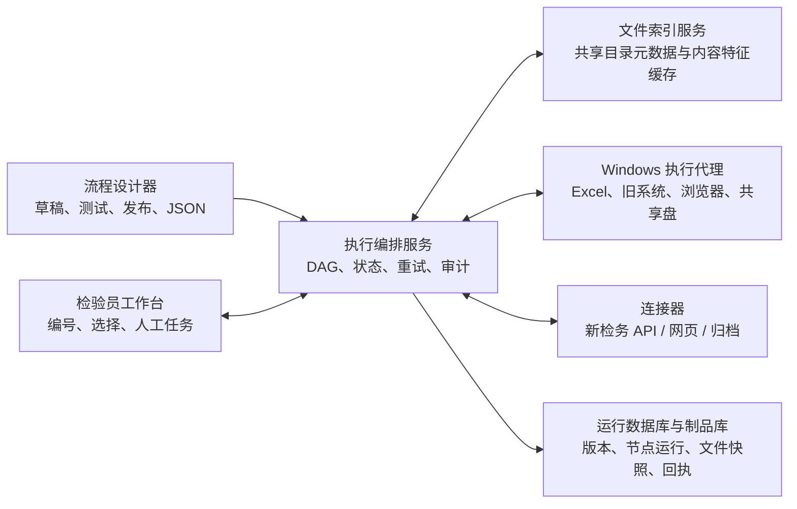

# 01. 总体构想与边界

> 状态：持续修订
> 最后更新：2026-07-24

## 1. 产品定位

“执行系统”用于把检测业务中重复、繁琐、容易遗漏的步骤，编排成可复用、可追踪、可人工介入的流程。

它的核心不是“无人值守地点击所有系统”，而是：

- 自动完成规则明确、重复度高的工作；
- 在需要判断、复核、确认或补录时，把任务准确交给对应人员；
- 每一步都保存输入、输出、操作者、时间和外部系统回执；
- 失败后从已完成节点继续，而不是整份检测工作重新来过；
- 用节点和子流程兼容棉/再生纤、麻棉、动物毛、微观形貌等不同项目。

建议使用的产品描述：

> 一个面向检测公司的低代码执行与协作平台，将原始记录、复核规则、Excel 处理、检务系统录入、图片归档和人工确认编排为可版本化的工作流。

## 2. 当前痛点

### 2.1 重复录入

- 面积识别已经生成或写入了部分 Excel 数据，检验员仍需手工补根数。
- 原始记录生成后，还要在检务系统的不同界面重复上传和录入。
- 微观形貌类项目还要按规则复制图片到共享目录。

### 2.2 流程依赖人的记忆

- 主检、复核、第三人测试的触发条件和最终取值规则需要人工判断。
- 不同项目的路径、模板、单元格和系统页面不同。
- 某一步失败后，检验员需要自己判断已经做到哪里。

### 2.3 文件和系统割裂

- 原始记录分散在多个局域网共享目录。
- 共享目录中文件多、访问慢，直接遍历会拖慢交互。
- 旧检务系统是 Windows 桌面程序，新系统是网页，自动化手段不同。
- Excel 公式、格式、宏、保护和重新计算可能依赖真实 Microsoft Excel。

### 2.4 缺少完整审计链

需要回答：

- 哪个流程版本处理了这份单？
- 使用了哪些原始记录，文件当时是什么版本？
- 谁选择了主单，谁提交了复核，为什么触发第三人？
- 哪些数据已经写入外部系统，外部系统返回了什么？
- 自动化失败后，人工修改了什么？

## 3. 目标

### 3.1 业务目标

1. 减少文件查找、复制、转录和重复录入时间。
2. 降低错选模板、错传文件、漏传图片、结果录错位置的概率。
3. 固化复核和第三人测试规则，但保留有记录的人工裁决入口。
4. 让同一批通用节点能复用于不同检测项目。
5. 自动沉淀工作量、执行耗时、失败原因和人工处理数据。

### 3.2 产品目标

1. 管理员可以通过流程图配置和发布工作流。
2. 节点实例可以自由命名，但节点类型和版本保持稳定。
3. 工作流可以导入/导出为带版本的 JSON，且不包含密码和机器绝对路径。
4. 检验员通过简洁工作台运行流程，不必理解整个节点画布。
5. 工作流支持串行、并行、条件分支、汇合、人工任务、暂停、恢复和局部重试。
6. 运行中的工作流固定使用已发布版本，管理员修改草稿不能改变历史运行。

## 4. 暂不追求的目标

- [不在当前阶段] 一开始就覆盖所有检测项目。
- [不在当前阶段] 第一版直接自动点击旧、新检务系统并正式提交。
- [不在当前阶段] 让普通用户编写任意 Python/脚本节点。
- [不在当前阶段] 通过一个万能节点解析所有未知 Excel 模板。
- [不在当前阶段] 把执行系统做成面向外部客户的多租户 SaaS。
- [不在当前阶段] 使用 AI 代替有明确标准的定量计算和复核规则。

## 5. 参与者与职责

| 角色 | 主要职责 |
|---|---|
| 系统管理员 | 用户、角色、运行环境、路径别名、凭据策略、节点插件管理 |
| 流程设计员 | 设计草稿、配置节点、测试流程、发布版本 |
| 检验员 | 发起执行、选择原始记录、补充数据、确认结果、处理异常 |
| 复核人员 | 提交独立结果、确认差异、处理退回 |
| 第三检验员 | 在超阈值时接受新增测试任务 |
| 审计/管理人员 | 查看执行证据、工作量、失败率和人工修改 |
| Windows 执行代理 | 在受控 Windows 环境中访问共享盘、Excel、旧客户端或浏览器 |

角色可以由同一自然人兼任，但系统需要保留“谁以什么角色完成了哪一步”。

## 6. 总体结构

## 7. 核心设计原则

1. **事实源唯一**：每类业务数据明确唯一事实源，避免 Excel、执行系统和检务系统相互覆盖。
2. **原件保护**：读取原件，写入副本；发布/替换是单独、可确认的动作。
3. **强类型契约**：节点连接前校验输入输出类型，不能靠运行时猜测字段。
4. **持久化人机协作**：人工输入是有负责人、有截止时间、有状态的任务。
5. **副作用最后执行**：外部系统上传、正式提交、覆盖文件等不可逆动作放在数据确认之后。
6. **幂等与对账**：每次外部写入都带业务幂等键，执行后查询或记录回执，避免重复提交。
7. **局部恢复**：并行分支独立保存；一个分支失败，不抹掉其它已完成结果。
8. **显式版本**：流程、节点、模板、类型识别规则和字段映射都带版本。
9. **最小权限**：流程 JSON 只引用凭据别名，实际密码加密保存，不进入日志和导出文件。
10. **人工掌握最终责任**：高风险或不可逆提交默认保留确认门，是否自动提交按流程单独授权。

## 8. 关键概念

| 概念 | 含义 |
|---|---|
| 工作流定义 | 可编辑的逻辑结构 |
| 工作流版本 | 一次不可变的已发布快照 |
| 工作流运行 | 某份检测任务对某个工作流版本的一次执行 |
| 节点类型 | 稳定的功能实现，例如“查询文件索引” |
| 节点实例 | 流程中的具体节点，可自由命名并带配置 |
| 节点运行 | 某节点实例在某次工作流运行中的状态、输入和输出 |
| 文件制品 | 带身份、来源、版本、校验和的文件对象 |
| 人工任务 | 工作流暂停并等待某个用户/角色输入、选择或批准 |
| 外部动作回执 | 对检务系统、共享目录等执行写操作后的证据和幂等记录 |
| 连接器 | 将节点与 Excel、旧系统、新系统或共享盘隔离的适配层 |
