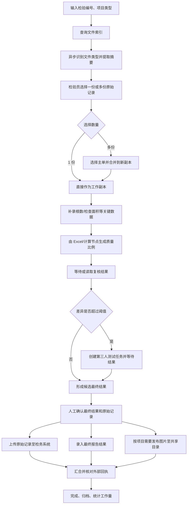

# 02. 领域流程与节点模型

> 状态：持续修订
> 最后更新：2026-07-24

## 1. 示例业务流程：棉和再生纤维素纤维物理法定量

以下流程是当前头脑风暴的“参考主线”，不是最终业务规则。



需要特别注意：

- O1、O2、O3 可以并行，但是否全部成功才算“整单完成”需要按项目配置。
- 某个外部步骤失败时，已成功分支不能重复执行。
- 第三人结果的最终取值规则尚未确认，不能直接假设为平均值。
- 工作流中应保存所有参与人的独立原始结果，而不仅保存一个最终数字。

## 2. 领域对象

### 2.1 检验任务 `InspectionCase`

建议字段：

- `case_id`：执行系统内部 ID；
- `inspection_no`：检务编号/样品编号；
- `project_type`：检测项目类型；
- `sample_name`、`sample_description`；
- `owner_user_id`：主检验员；
- `source_system`：旧系统/新系统/其它；
- `workflow_run_id`；
- `status`；
- `created_at`、`due_at`。

### 2.2 独立检测结果 `MeasurementSubmission`

每位参与人应形成独立提交：

- 提交人及角色：主检、复核、第三人；
- 结果明细：成分、根数、面积、质量比例、备注；
- 对应原始记录文件；
- 使用的模板、计算规则和软件版本；
- 提交时间；
- 是否被人工修正及修正原因。

### 2.3 最终结果 `FinalResult`

最终结果不是简单覆盖前面的结果，而是：

- 来源提交列表；
- 差异计算结果；
- 采用的决策规则版本；
- 最终成分与数值；
- 决策人；
- 必要时的人工裁决理由。

### 2.4 文件制品 `FileArtifact`

工作流节点不直接传递裸路径，建议统一使用：

```json
{
  "artifact_id": "art_xxx",
  "root_id": "regenerated_records",
  "relative_path": "2026/07/24/26012345.xls",
  "display_name": "26012345.xls",
  "extension": ".xls",
  "size": 123456,
  "mtime": "2026-07-24T08:30:00Z",
  "content_hash": "sha256:...",
  "detected_type": "cotton_regenerated_quantitative",
  "type_confidence": 0.98,
  "template_version": "cotton-regenerated-v3",
  "source": "file_index",
  "read_only": true
}
```

这样可以：

- 防止工作流导出后携带机器绝对路径；
- 通过 `root_id` 映射不同部署环境；
- 用哈希和修改时间判断执行期间文件是否变化；
- 记录文件来源和处理链；
- 对文件访问做统一安全校验。

## 3. 文件读取节点的拆分建议

用户原始想法中的“从再生纤/麻棉/动物毛路径读取表格”可以抽象为多个职责，而不是一个万能节点。

### 3.1 查询文件索引节点 `file.index.query`

职责：

- 指定一个或多个根目录别名；
- 设置最大子目录深度，例如 `1`；
- 按编号、文件名正则、日期、项目类型提示查询；
- 默认返回最近 7 天、最多 6 个结果；
- 支持“要求最新”模式，触发目标目录的增量刷新后再返回。

输出：

- `files: FileArtifact[]`；
- `index_fresh_at`；
- `is_fresh`；
- `truncated`；
- `warnings`。

重要建议：

- “最近 7 天、最多 6 个”只作为默认查询和 UI 展示限制，不应成为索引永久丢弃旧文件的规则。
- 复检、延期和历史补录可能需要更早的记录，应允许展开查询。

### 3.2 文件类型识别节点 `excel.type.detect`

建议采用分层识别：

1. 根目录/一级子目录作为弱提示；
2. 文件名正则作为弱提示；
3. 工作表名称、模板版本单元格、固定标题、关键单元格组合形成内容签名；
4. 输出类型、置信度和不匹配原因。

不要只依赖一个单元格。更稳妥的“模板指纹”可包含：

- 工作表集合；
- 固定文字所在单元格；
- 合并单元格范围；
- 关键公式或命名区域；
- 模板内部版本号；
- 允许为空但位置固定的输入区域。

目录提示与内容指纹冲突时，应显示警告并要求人工确认，不能静默归类。

### 3.3 Excel 摘要提取节点 `excel.record.extract`

输入：

- `file: FileArtifact`；
- `mapping_profile_id`；
- `read_mode`；
- `cache_policy`。

输出建议：

- 检验编号；
- 检验员；
- 项目/成分；
- 根数；
- 面积；
- 含量/质量比例；
- 备注；
- 图片引用；
- 缺失字段和校验警告；
- `structured_record`；
- 提取配置版本。

摘要结果应该缓存，但缓存键至少包含文件标识、哈希或 `mtime + size`，文件变化后必须重新提取。

## 4. “主单标记”如何建模

### 4.1 不建议全局修改文件池状态

“主单”只对某次执行有意义。同一文件未来可能在另一份流程中作为来源文件，因此不应在全局文件池永久写入 `is_primary=true`。

### 4.2 暂定方案

- 选择 1 份文件：系统自动把它作为 `primary_file`，跳过人工选择。
- 选择多份文件：创建“选择主单”人工任务。
- 主单角色保存在当前 `workflow_run` 的输入映射中。
- 源文件保持只读，不在原文件上写标记。

“选择主单”可以作为一个可复用的人机交互节点：

```text
输入：files: FileArtifact[]
输出：primary_file: FileArtifact
      source_files: FileArtifact[]
```

## 5. Excel 数据合并节点

### 5.1 输入契约

```text
primary_file: WorkbookArtifact
source_files: WorkbookArtifact[]
mapping_profile_id: string
conflict_policy: enum
output_policy: enum(copy_only / publish_after_approval)
```

### 5.2 执行阶段

1. 预检查所有文件存在且未变化；
2. 校验模板类型和版本兼容；
3. 读取目标区域和来源数据；
4. 生成冲突清单；
5. 在隔离目录复制主单；
6. 将数据写入副本；
7. 使用正确的 Excel 计算环境刷新公式；
8. 重读关键单元格并核对；
9. 生成合并报告；
10. 输出新制品，等待后续确认或发布。

任一预检查失败时，不得修改原文件。

### 5.3 输出契约

```text
merged_workbook: WorkbookArtifact
merged_record: StructuredRecord
merge_report: MergeReport
warnings: Warning[]
source_artifact_ids: string[]
```

### 5.4 冲突策略

至少要支持：

- 阻止执行并要求人工选择；
- 主单优先；
- 来源文件优先；
- 指定字段按规则合并；
- 只预览差异，不写入。

“最后写入者覆盖”不应成为默认策略。

## 6. 节点实例、节点类型和节点契约

### 6.1 节点类型

节点类型由系统或插件提供，例如：

- `file.index.query`；
- `excel.type.detect`；
- `excel.record.extract`；
- `excel.workbook.merge`；
- `human.select.artifacts`；
- `result.compare`；
- `external.fibrecheck.upload_record`。

节点类型必须有稳定 ID 和版本。

### 6.2 节点实例

管理员可以自由命名，例如：

- “查找棉再原始记录”；
- “选择本次主单”；
- “复核差异判断”。

自由名称只是显示名称，不能改变节点类型的输入输出语义。

### 6.3 每种节点应声明

- 节点类型与版本；
- 配置表单 Schema；
- 输入 Schema；
- 输出 Schema；
- 是否产生外部副作用；
- 是否可以自动重试；
- 是否要求幂等键；
- 是否需要 Windows Agent；
- 是否需要 Excel；
- 是否需要人工任务；
- 是否需要资源锁；
- 允许哪些角色配置和执行；
- 超时、取消和补偿策略。

## 7. 建议的强类型数据

基础类型：

- `string`、`boolean`、`integer`；
- `decimal`：质量比例等计算禁止只用二进制浮点；
- `date`、`datetime`；
- `enum`；
- `object`、`array<T>`。

领域类型：

- `InspectionNumber`；
- `FileArtifact`、`FileArtifact[]`；
- `WorkbookArtifact`；
- `ImageArtifact[]`；
- `StructuredRecord`；
- `MeasurementSubmission`；
- `ComparisonResult`；
- `FinalResult`；
- `CredentialRef`；
- `ExternalActionReceipt`。

同为 JSON 对象也不能随意连接。例如 `FileArtifact[]` 不能直接接入要求 `StructuredRecord[]` 的节点。

## 8. 初始节点目录

### 8.1 触发与人工交互

- 用户输入/发起执行；
- 选择项目类型；
- 选择文件；
- 选择主单；
- 数据补录；
- 结果预览与确认；
- 复核提交；
- 第三人任务；
- 异常裁决；
- 最终提交确认。

### 8.2 文件与 Excel

- 查询文件索引；
- 刷新指定目录索引；
- 文件类型识别；
- Excel 摘要提取；
- 模板校验；
- Excel 数据合并；
- 单元格写入；
- 公式重新计算；
- Excel 关键字段核对；
- 生成工作副本；
- 发布/归档文件。

### 8.3 结果与规则

- 数据标准化；
- 成分名称映射；
- 质量比例计算；
- 两人结果比较；
- 阈值判断；
- 第三人触发；
- 最终结果聚合；
- 规则表/决策表；
- 人工覆盖并记录理由。

### 8.4 外部连接器

- 旧检务系统账号选择；
- 新检务系统账号选择；
- 上传原始记录；
- 录入报告结果；
- 查询是否已提交；
- 保存外部回执；
- 共享目录图片发布；
- 通知；
- 工作量统计。

### 8.5 控制节点

- 条件分支；
- 并行分支；
- 汇合；
- 循环/逐项处理；
- 延时/等待；
- 子流程；
- 错误边；
- 结束节点。

## 9. 工作流 JSON 的初步结构

以下只定义方向，不是最终 Schema：

```json
{
  "schema_version": "0.1",
  "workflow": {
    "key": "cotton-regenerated-quantitative",
    "name": "棉和再生纤维素定量执行流程",
    "version": 3
  },
  "required_capabilities": [
    "file-index",
    "excel-desktop"
  ],
  "nodes": [
    {
      "id": "node_find_records",
      "type": "file.index.query",
      "type_version": "1.0",
      "name": "查找棉再原始记录",
      "position": {"x": 260, "y": 180},
      "config": {
        "root_ids": ["regenerated_records"],
        "max_depth": 1,
        "default_days": 7,
        "default_limit": 6
      },
      "inputs": {
        "inspection_no": {"from": "workflow.input.inspection_no"}
      }
    }
  ],
  "edges": [],
  "ui": {},
  "metadata": {}
}
```

导出时必须排除：

- 密码、Cookie、Token；
- 真实凭据 ID；
- 用户私有账号内容；
- 机器绝对路径；
- 运行产生的实际检测数据；
- 临时文件地址。

凭据和路径在导入后通过别名重新绑定。
