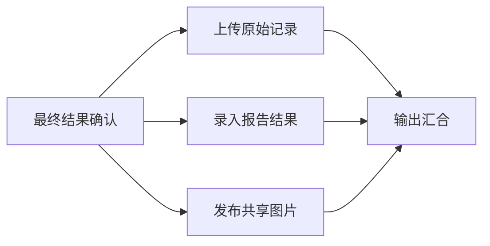

# 03. 交互与运行机制

> 状态：持续修订
> 最后更新：2026-07-24

## 1. 两套界面必须分开

### 1.1 流程设计器

面向管理员和流程设计员：

- 节点画布；
- 节点配置；
- 输入输出端口；
- 条件和并行分支；
- 调试数据；
- 草稿、测试、发布、版本比较；
- JSON 导入导出；
- 节点权限和运行能力检查。

### 1.2 执行工作台

面向繁忙的检验员：

- 输入/扫描编号；
- 快速选择项目类型；
- 查看候选记录摘要；
- 多选原始记录和确定主单；
- 处理当前人工任务；
- 查看关键业务里程碑；
- 对失败步骤重试或转人工；
- 查看最终文件、结果和外部提交状态。

普通检验员不应被迫看完整流程图和技术节点日志。

## 2. 检验员主流程

建议在一个页面完成主要操作。

```text
┌────────────────────────────────────────────────────────────────────┐
│ 检验编号 [扫码或输入________________]  [棉再] [麻棉] [动物毛] [其它] │
│ 根据 10:31:22 的索引找到 6 份记录，正在后台核对…      [定向强制刷新] │
├────────────────────────────────────────────────────────────────────┤
│ 候选原始记录卡片：每行 2～3 张，卡片内部异步更新                     │
│                                                                    │
├────────────────────────────────────────────────────────────────────┤
│ 固定操作条：已选 2 份｜主单：260724001.xlsx [更改]｜[开始执行]       │
└────────────────────────────────────────────────────────────────────┘
```

交互顺序：

1. 页面打开后自动聚焦编号输入框；
2. 输入或扫码后立即查索引，不等待全目录遍历；
3. 类型快捷按钮先收窄候选根目录；
4. 候选卡片先显示文件元数据；
5. 后台异步读取类型、检验员、成分、含量、根数、面积和备注；
6. 单张卡解析失败只影响该卡；
7. 用户可在其它卡仍解析时选择已就绪记录；
8. 选择 1 份时自动作为工作文件；
9. 选择多份时自动建议或要求确认主单；
10. 开始执行前统一检查文件是否存在、是否变化、模板是否匹配。

建议支持：

- `Enter` 搜索；
- 方向键切换卡片；
- `Space` 选中；
- `Ctrl/Cmd + Enter` 开始执行；
- 扫码枪输入后自动触发查询。

## 3. 原始记录卡片

默认最多展示约 6 个候选时，紧凑卡片比纵向列表更容易横向比较。候选很多时可切换高密度表格。

### 3.1 第一层：一眼确认

- 检验编号；
- 项目类型；
- 检验员；
- 文件状态：解析中、可用、类型不符、文件变化、文件丢失；
- 选中状态；
- 主单标记。

### 3.2 第二层：用于比较

字段由项目模板定义，例如：

```text
棉 52.4% · 再生纤维素纤维 47.6%
根数 126 / 114
```

公共卡片不能硬编码棉再字段，应由节点的“摘要展示 Schema”声明。

### 3.3 第三层：低频详情

- 文件名；
- 修改时间；
- 根目录和相对路径；
- 模板版本；
- 识别依据；
- 原始单元格位置。

这些信息放到右侧抽屉，不占用卡片主体。

## 4. 节点是否主动弹窗

### 4.1 结论

**节点可以要求人工输入，但流程语义应是“创建人工任务并暂停”，而不是“弹出一个弹窗”。**

原因：

- 页面关闭、刷新或断线后任务仍然存在；
- 复核和第三人可能几小时后才处理；
- 多个流程同时运行时，任务需要明确归属；
- 可以转交、提醒、超时和审计；
- 弹窗不会在用户录入其它任务时突然遮挡界面。

### 4.2 人工任务的数据

- 任务 ID；
- 所属工作流运行和节点；
- 标题、说明和业务上下文；
- 指定处理人或角色；
- 表单 Schema；
- 默认值；
- 校验规则；
- 允许操作：确认、驳回、退回、重新检测、选择第三人等；
- 是否阻塞下游；
- 创建、领取、保存草稿和完成时间；
- 截止时间、提醒和转交；
- 修改前后数据；
- 输出 Schema。

### 4.3 前端展示策略

| 任务复杂度 | 推荐展示 |
|---|---|
| 简单确认、少量补录 | 当前运行页面中的任务卡 |
| 需要同时查看结果和文件 | 右侧抽屉 |
| 复杂复核、图像选择、多字段录入 | 独立人工任务页面 |
| 用户已离开当前运行 | 全局“待我处理”任务箱 |
| 用户不在网页中 | 通知只负责提醒，不承载录入 |

仅当任务由用户刚刚主动触发、必须立即回答、字段很少且关闭不会丢数据时，UI 才可以用模态框承载。

## 5. 复核与第三人交互

差异超阈值时不应突然弹窗，而应产生明确任务：

```text
待处理：主检与复核结果超出允许差异

王工：棉 52.4%
李工：棉 48.7%
允许阈值：3.0 个百分点

[查看完整差异] [指定第三人] [退回重新检查]
```

系统应允许：

- 自动按排班或能力分配第三人；
- 指定人员；
- 第三人拒绝/转交；
- 设置时限和提醒；
- 第三人提交后重新进入裁定；
- 无法自动裁定时要求有权限的人员确认并填写理由。

## 6. 执行状态如何展示

检验员看业务里程碑：

```text
样品 260724001                          等待复核

✓ 找到并校验原始记录
✓ 合并原始数据
✓ 计算初检结果
● 等待复核人员提交
○ 生成最终结果
○ 归档与检务系统录入
```

管理员可以展开技术详情，查看：

- 完整 DAG；
- 节点输入输出；
- 尝试次数；
- 执行代理；
- 技术日志；
- 外部请求和回执；
- 数据与模板版本。

## 7. 并行执行和汇合

“关键步骤串行、输出步骤并行”适合用 DAG 表达。

示例：



每个分支声明：

- `required`：失败则整单不能完成；
- `best_effort`：失败可进入待补办，但不阻止核心完成；
- `not_applicable`：该项目不需要执行；
- 重试策略；
- 超时后是否转人工；
- 幂等和对账方式。

即使都属于 `required`，也可并行执行。某一分支失败时，成功分支保持完成，只重试失败分支。

## 8. 运行状态

工作流运行至少区分：

- 草稿测试；
- 排队中；
- 执行中；
- 等待人工；
- 等待外部系统；
- 自动重试中；
- 部分完成；
- 可恢复失败；
- 业务校验不通过；
- 配置错误；
- 已完成；
- 已取消；
- 已终止并需要人工收尾。

节点运行至少区分：

- `pending`；
- `ready`；
- `running`；
- `waiting_human`；
- `waiting_external`；
- `retry_scheduled`；
- `succeeded`；
- `failed_recoverable`；
- `failed_terminal`；
- `skipped`；
- `cancelled`。

## 9. 错误信息

错误必须回答：

1. 发生了什么；
2. 哪些数据或外部步骤已经安全完成；
3. 用户接下来可以做什么。

示例：

```text
旧检务系统暂时无法连接

原始记录合并和最终结果已经完成；
检务系统尚未上传，不会重复写入。

系统将在 60 秒后进行第 3 次重试。

[立即重试] [稍后处理] [查看技术详情]
```

## 10. 暂停、恢复和修改

- 运行状态和节点结果持久化；
- 刷新、退出登录和服务重启后可以继续；
- 成功节点默认不重跑；
- 原文件发生变化时阻止继续，并要求重新确认；
- 修改已完成节点的输入，应创建新的运行修订或从明确检查点重放；
- 已写入外部系统的数据发现错误后，必须走“修订/撤回/补正”流程，不能静默覆盖；
- 管理员发布新流程版本不能改变已经开始的运行。

## 11. 账号与权限

### 11.1 初始角色

- 管理员；
- 流程设计员/发布员；
- 检验员；
- 复核人员；
- 第三检验员/裁定人员；
- 审计只读人员。

### 11.2 用户自有外部账号

[已确认] 每个用户在自己的账号中维护：

- 旧检务系统账号绑定；
- 新检务系统账号绑定。

建议：

- 系统只保存加密后的凭据或本机凭据引用；
- 工作流 JSON 只写 `credential_alias`；
- 管理员可以看“已配置/失效”，默认不能查看明文；
- 密码、Cookie、Token 不进入节点日志；
- MFA、验证码、登录过期转为人工接管任务；
- 外部动作记录实际使用的用户身份。

### 11.3 职责分离

[待确认] 是否要求：

- 初检人员不能复核自己的结果；
- 第三人不能是前两人；
- 流程设计和发布由不同人员完成；
- 最终自动提交仍需检验员确认。

这些规则应由权限/指派策略实现，而不是写死在某个 Excel 节点中。
