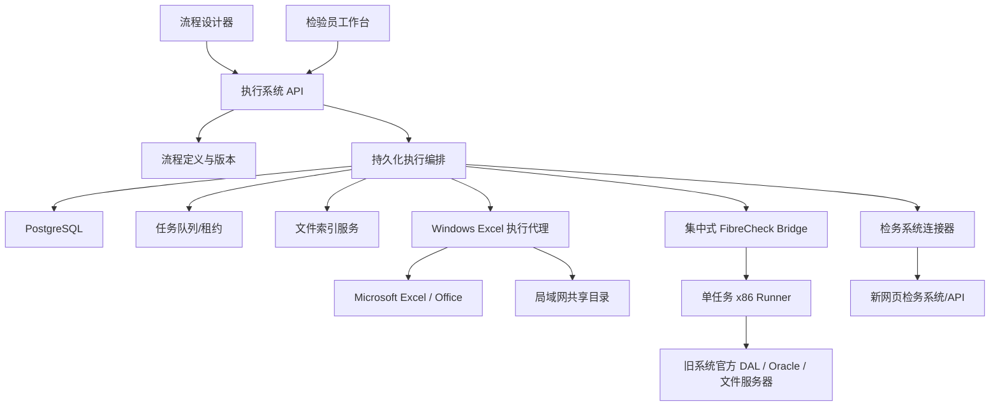

# 04. 技术方向与可行性

> 状态：方向评估，不是最终技术选型
> 最后更新：2026-07-30

## 1. 是否直接 Fork Dify

### 1.1 值得参考的部分

Dify 的工作流思路与本项目有共通点：

- 画布上的节点和边；
- 节点实例可命名；
- 输入变量和下游引用；
- 条件、循环、聚合和工具节点；
- 流程测试；
- 人工输入；
- 运行事件；
- 导入/导出 DSL。

Dify 官方文档已经存在可暂停运行的 Human Input 机制：运行产生 `human_input_required`，通过表单 Token 获取和提交人工输入。这说明“人工任务不是弹窗，而是持久化暂停点”是成熟方向。

参考：

- [Dify GitHub](https://github.com/langgenius/dify)
- [Dify Human Input API](https://docs.dify.ai/api-reference/human-input/get-human-input-form)
- [Dify Tool Return / Output Schema](https://docs.dify.ai/en/develop-plugin/features-and-specs/plugin-types/tool)

### 1.2 不适合直接照搬的部分

Dify 的中心场景仍是 AI/LLM 应用，而本系统更重视：

- Excel 文件的版本、来源和格式保真；
- 长时间等待复核和第三人；
- Windows 桌面程序和 Office 自动化；
- 外部系统写入的幂等、对账和人工接管；
- 检测结果的精度、规则版本和职责分离；
- 内网共享盘的索引和一致性；
- 审计证据和原始记录不可破坏。

直接 Fork 整仓会带来：

- 大量与模型、知识库、对话、插件市场相关的无关复杂度；
- 后续合并上游更新的成本；
- 领域数据模型仍需大改；
- 现有 FastAPI/React/PostgreSQL 项目需要重新整合；
- 许可证和前端外观约束。

### 1.3 许可证注意

截至本次调研，Dify 主仓库使用“基于 Apache 2.0 的 Dify Open Source License”，附加了多租户和前端 LOGO/版权等条件，并提到交互设计外观保护。参见：

- [Dify LICENSE](https://github.com/langgenius/dify/blob/main/LICENSE)

这不等于当前内部使用一定不可行，但在决定 Fork、修改前端和未来部署边界前，必须单独完成许可证审查。本文件不构成法律意见。

### 1.4 更值得单独评估的 Graphon

Dify 已把部分图执行引擎拆分为 [langgenius/graphon](https://github.com/langgenius/graphon)。其仓库当前标示为 Apache-2.0，并提供：

- 队列驱动的图执行；
- 图解析和校验；
- 运行状态和变量池；
- 事件；
- 文件、HTTP、工具和 Human Input 协议；
- Dify DSL 导入。

但它仍在演进，主要面向 agentic AI，且不等于具备本项目所需的长期人工任务、外部副作用对账和检测领域模型。

### 1.5 暂定结论

**现在不做“Fork Dify”决策。**

后续用一个短期技术验证比较：

| 方向 | 优点 | 风险 |
|---|---|---|
| 借鉴 Dify UI，自研领域执行内核 | 最贴合业务，依赖少 | 持久化、重试、调度等需要认真设计 |
| Graphon + 自建持久化/领域层 | 可复用图执行和事件模型 | 项目较新，AI 偏向，需验证暂停恢复 |
| Fork Dify | 画布和大量功能现成 | 许可证、体量、无关功能、升级成本最高 |
| 专用耐久工作流引擎 + 自建画布 | 状态恢复和重试成熟 | 引入新基础设施和学习成本 |

优先级建议：

1. 先冻结自己的领域对象和节点契约；
2. 再用相同示例流程分别验证候选执行内核；
3. 不让第三方 DSL 反向决定检测业务的数据模型。

## 2. 建议的总体技术结构



### 2.1 服务端编排

职责：

- 用户、角色和工作流版本；
- DAG 校验和调度；
- 节点运行状态；
- 人工任务；
- 制品和数据血缘；
- 重试、超时、取消和汇合；
- 外部动作幂等记录；
- 审计和通知。

执行器应是独立 Worker，不应依赖 FastAPI 进程内的临时后台任务。Web 服务重启后，Worker 必须能从数据库恢复 `ready`、等待重试和租约过期的节点。

当前状态可使用关系表高效查询，同时把关键状态变化写成追加式审计事件。第一版不必做纯事件溯源，但建议使用事务 Outbox，确保“数据库已提交”和“任务/通知事件已发布”不会互相丢失。

### 2.2 Windows Excel Agent 与 FibreCheck Bridge

很多动作不适合在 Linux Docker 容器里完成：

- 使用真实 Excel 打开、重算和保存；
- 加载旧 FibreCheck 的 x86 .NET Framework 4.0、ODP.NET 和官方 DAL；
- 访问特定映射盘、证书或本机凭据；
- 必要时驱动浏览器。

两类能力不再强行放进同一种桌面 Agent：

- Excel 高保真重算仍可由受控 Windows Agent 提供 `excel-desktop` 能力；
- 旧 FibreCheck 采用一台集中式无界面 Bridge，不要求每个检验员电脑安装 Agent；
- Bridge 每笔任务启动一个独立 x86 Runner，一个进程只承载一个旧系统账号和
  一次外部操作，结束后立即退出；
- Bridge 首版全局写入并发为 1，多人请求进入 PostgreSQL 持久队列；验证稳定后
  才放宽到 2～4；
- 同账号、同一前 9 位样品家族和同目标文件始终串行；
- 原 WPF UI 自动化只保留为人工兜底，不作为生产主路径。

两者共同遵循：

- 主动向服务端领取带租约的节点任务，避免服务端反向开放 Windows 入站端口；
- 使用部署级认证；
- 只允许白名单节点；
- 每个任务带幂等键、输入制品哈希和超时；
- 上报进度、日志、输出文件和外部回执；
- 副作用开始前断线可恢复；开始后结果未知必须进入人工对账，不能盲目重试；
- 凭据优先放在 Windows Credential Manager 或加密凭据库中。

Bridge 不依赖已登录桌面会话。静态逆向已确认旧系统登录本质为 Oracle 账号查询、
旧口令算法校验、人员/机构初始化和权限加载，可以在 x86 Runner 中重现等价的
无界面链路；不能直接调用会创建 WPF 主窗和后台任务的原登录方法。

资源锁初步包括：

- `excel_com`；
- `fibrecheck_bridge_capacity`；
- 旧系统账号作用域；
- 前 9 位样品家族；
- 目标输出文件；
- 某个检验编号的正式提交；
- 远端结果未知时不可自动释放的对账锁。

## 3. 文件索引服务

### 3.1 为什么不能在每次搜索时遍历共享盘

- SMB/共享目录延迟高；
- 历史目录可能包含大量图片和记录；
- 多用户同时搜索会放大 I/O；
- 文件正在写入时可能读到半成品；
- 文件系统事件在网络共享上不总可靠。

### 3.2 建议机制

组合使用：

1. 定时增量扫描；
2. 较低频的完整核对；
3. 允许时使用文件系统事件作为加速提示；
4. 用户“强制刷新”时，只扫描相关根目录、编号前缀和一级子目录；
5. 发现新文件后等待稳定窗口，再做内容解析；
6. 忽略 `~$` 等 Office 临时文件；
7. 文件变更只重新解析受影响文件。

### 3.3 索引字段

- 根目录别名和相对路径；
- 文件名、扩展名；
- 大小、修改时间；
- 首次发现和最后确认时间；
- 文件稳定状态；
- 内容哈希或分段指纹；
- 检验编号；
- 类型及置信度；
- 模板版本；
- 检验员、成分、结果摘要；
- 解析规则版本；
- 解析错误；
- 是否已经归档或被某次运行引用。

### 3.4 新鲜度语义

接口不能只返回“有/无”，还要返回：

- 索引更新时间；
- 是否完成实时核对；
- 是否可能存在漏项；
- 是否截断显示；
- 强制刷新任务状态。

“主动刷新必须最新”应实现为一个定向刷新屏障：先完成相关目录的增量扫描，再返回候选结果，而不是全盘扫描。

## 4. Excel 的正确性边界

### 4.1 解析与重算是两件事

Python 库适合：

- 读取工作表、单元格和部分格式；
- 做模板指纹和数据抽取；
- 生成预检查报告。

但很多库不会真正执行 Excel 公式。若最终结果依赖公式、宏、外部链接或 Excel 特有行为，需要 Windows Agent 使用真实 Excel 自动化进行：

1. 打开隔离副本；
2. 刷新/重算；
3. 等待计算完成；
4. 保存；
5. 关闭；
6. 重新读取关键结果并核对。

### 4.2 必须先取证

[待确认]

- 文件是 `.xls`、`.xlsx` 还是 `.xlsm`；
- 是否含 VBA、图片、命名区域、外部链接、隐藏工作表；
- 是否有密码、保护视图或只读提示；
- 公式计算模式；
- 是否要求 WPS 和 Excel 同时兼容；
- 原始记录上传后是否校验文件内容或只留档。

### 4.3 原件与输出

- 原始记录进入流程时生成文件快照；
- 合并只写工作副本；
- 输出文件带来源和规则版本；
- 发布到正式目录前再次校验；
- 原文件若在运行中变化，阻止静默覆盖；
- Excel 进程异常退出后必须清理锁文件和孤儿进程，但不能误杀用户正常打开的 Excel。

## 5. 检务系统连接器

### 5.1 新网页系统

优先顺序：

1. 正式 API；
2. 内部稳定接口并经授权；
3. 浏览器自动化；
4. 人工接管。

浏览器自动化必须：

- 用稳定定位，不依赖屏幕坐标；
- 校验当前单号和页面状态；
- 提交前预览；
- 记录提交后的业务 ID/回执；
- 处理登录过期、验证码和页面升级；
- 支持“查询是否已经写入”，避免超时后重复提交。

### 5.2 旧桌面系统

[后续取证] `.tmp/FibreCheck/` 和 `.tmp/fibrecheck_tools/` 已存在，但目前不在没有内网和测试账号的情况下深入下结论。

可能路径：

- 已有 WebService/接口；
- 数据库或服务层的受控调用；
- 程序内部组件；
- Windows UI 自动化。

上层节点不应关心底层手段。无论新旧系统，都应暴露领域能力：

```text
查询检验任务
上传原始记录
写入最终结果
查询提交状态
获取外部回执
撤回/修订（若系统支持）
```

### 5.3 外部副作用通用要求

- 执行前预检查；
- 业务幂等键；
- 目标单号二次确认；
- 操作者身份；
- 请求/响应摘要；
- 成功回执；
- 超时后的查询对账；
- 局部重试；
- 人工接管；
- 禁止在不确定状态下自动重复提交。

## 6. 数据与持久化对象

初步数据表/集合：

- `users`、`roles`、`user_role_bindings`；
- `credential_bindings`；
- `workflow_definitions`；
- `workflow_versions`；
- `node_type_versions`；
- `workflow_runs`；
- `node_runs`；
- `human_tasks`；
- `artifacts`；
- `artifact_relations`；
- `file_index_entries`；
- `external_action_receipts`；
- `agent_registrations`；
- `agent_task_leases`；
- `node_attempts`；
- `outbox_events`；
- `audit_events`。

工作流运行时只引用不可变的 `workflow_version_id`。

## 7. 安全与审计

### 7.1 账号

- 执行系统形成独立认证边界，不需要顺手改变现有设备监控的内网访问方式；
- 新旧系统凭据分开；
- 每个用户维护自己的绑定；
- 密文和密钥分离；
- 流程导出不带凭据；
- 日志默认脱敏；
- 管理员不能通过普通管理界面查看明文；
- 凭据使用、失效和更换都记录审计。

### 7.2 文件

- 根目录别名 + 相对路径；
- 扩展名、真实路径、符号链接和根目录包含检查；
- 节点只能访问声明的根目录；
- 文件发布采用临时文件、原子替换或可回滚清单；
- 每次执行保存输入输出哈希。

### 7.3 审计

记录：

- 工作流和节点版本；
- 每个节点最终输入输出摘要；
- 人工任务处理人；
- 规则计算详情；
- 文件血缘；
- 外部系统回执；
- 人工覆盖前后的值和理由；
- 重试、跳过、取消、转交。

## 8. 初步可行性判断

| 能力 | 可行性 | 主要不确定性 |
|---|---|---|
| 工作流画布、节点命名、JSON 导入导出 | 高 | Schema 和版本策略 |
| 文件索引、最近 7 天查询、一级子目录 | 高 | SMB 规模和刷新时限 |
| Excel 类型识别和摘要提取 | 高 | 模板数量和历史变体 |
| Excel 副本合并 | 中高 | `.xls`、宏、图片、保护 |
| 真实公式重算 | 中高 | Windows + Excel 环境稳定性 |
| 主检/复核/第三人流程 | 高 | 业务规则尚未明确 |
| 人工任务、暂停恢复、局部重试 | 高但属于核心难点 | 执行内核选型 |
| 新网页系统对接 | 中至高 | 是否有 API、页面稳定性 |
| 旧桌面系统对接 | 中或偏低 | 内部接口、版本和 UI 自动化稳定性 |
| 图片共享目录自动归档 | 高 | 命名、覆盖、权限规则 |
| 完全无人值守正式提交 | 暂不建议作为第一阶段目标 | 法规、责任、MFA、异常处理 |

## 9. 关键风险

1. 把工作流当成瞬时函数，后期才补人工等待和恢复；
2. 节点输出都是任意 JSON，流程连接错误只能运行时发现；
3. 直接修改原始 Excel；
4. 用普通库读取公式缓存，却误认为已重新计算；
5. 外部系统成功但响应超时，重试产生重复数据；
6. 同一单号被多人同时执行；
7. 工作流发布后仍可改变运行中的逻辑；
8. 凭据随 JSON、日志或错误栈泄露；
9. 把旧系统 UI 自动化当成稳定 API；
10. 过早 Fork Dify，业务规则反而被第三方架构限制。
