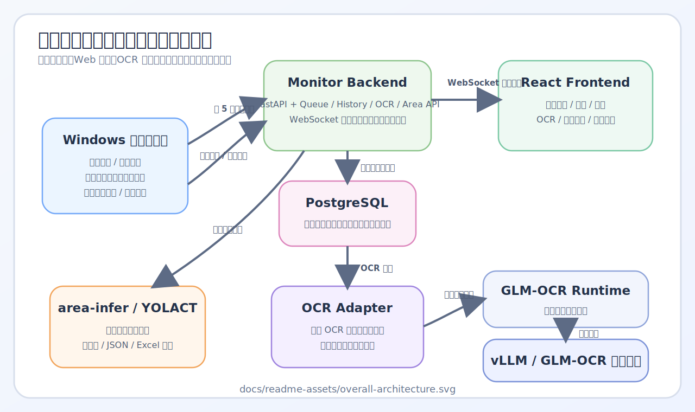
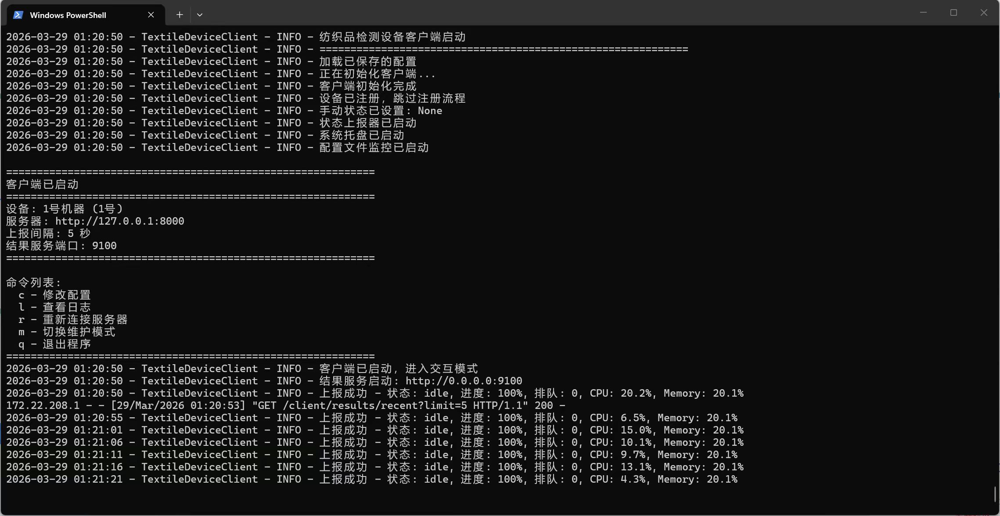
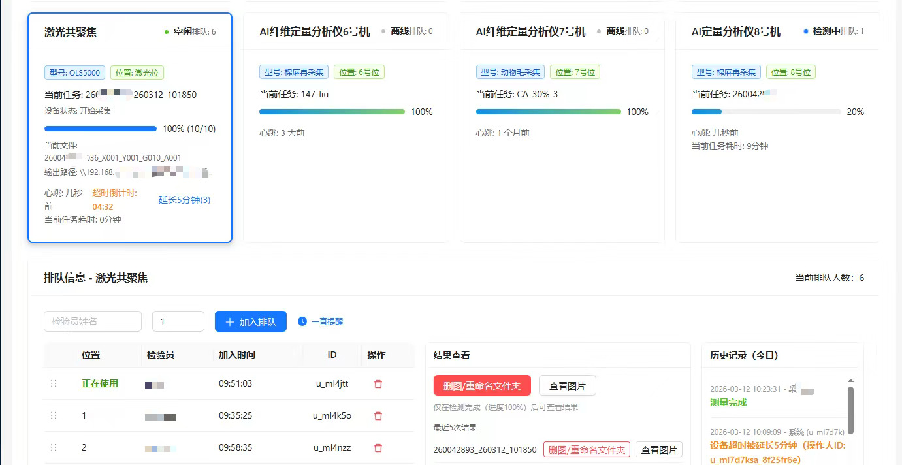
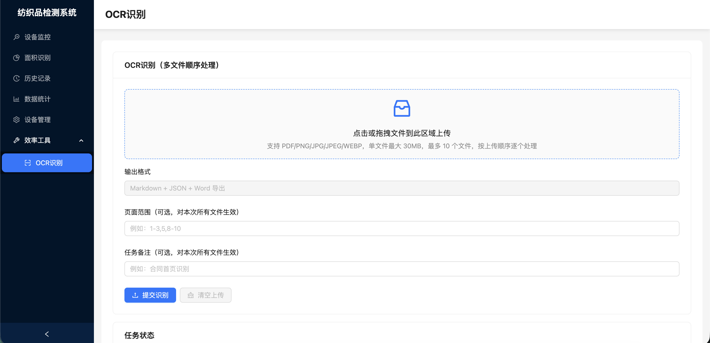
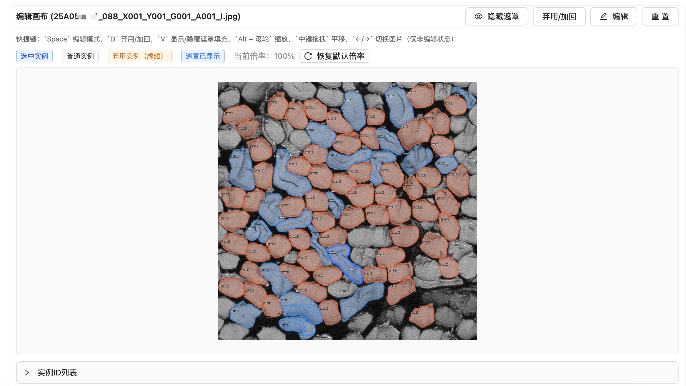

# 纺织检测设备监控与智能分析工作区

本项目不是单一应用，而是一套围绕纺织检测设备搭建的完整工作区。项目把设备侧状态采集、局域网监控看板、排队协同、结果浏览、OCR 文档识别、纤维面积识别几条链路整合到了一起，适合实验室或产线中的多设备协同场景。

## 项目解决什么问题

在这类业务场景里，常见痛点通常不是“没有检测能力”，而是“检测过程和结果分散在多台机器上，协同成本很高”：

- 设备运行进度分散在各自电脑里，现场很难统一查看。
- 检验员排队依赖口头沟通，顺序调整和完成提醒容易混乱。
- 结果文件、截图、表格散落在设备本地，管理端很难集中访问。
- 面积法和 OCR 这类智能能力通常是单点工具，没有融入日常流程。

这个仓库的整体设计就是围绕这些问题展开：

- 用 Windows 客户端贴近设备端，自动读取工作目录或日志，定时上报状态。
- 用 FastAPI + PostgreSQL 保存实时状态、历史记录、排队信息和任务结果。
- 用 React 前端提供局域网统一入口，实时展示设备状态、历史、统计和工具页面。
- 用独立 OCR / Area 服务把文档识别、纤维面积识别接入主业务系统。

## 仓库分析

### 1. 系统分层



从代码结构来看，这个工作区可以拆成 3 层：

1. 设备侧采集层  
   `textile-device-client` 运行在 Windows 设备机上，负责读取工作目录、采集系统指标、上报设备状态，并暴露本机结果访问接口。

2. 业务中台层  
   `textile-device-monitor/backend` 是整个系统的核心中台，负责设备管理、排队、历史、统计、结果转发、OCR 任务、面积识别任务和定时清理。

3. 智能能力层  
   `ocr-service`、`ocr-runtime`、`ocr-vllm` 和 `textile-device-monitor/area-infer` 提供 OCR 与面积识别能力，由主后端统一编排。

### 2. 目录职责

| 目录 | 作用 | 说明 |
| --- | --- | --- |
| `textile-device-monitor/` | 主 Web 系统 | 包含前端、后端、面积识别服务、运行时资源、Docker 编排 |
| `textile-device-monitor/frontend/` | 管理端界面 | React + Ant Design，看板、工具、历史、统计等 |
| `textile-device-monitor/backend/` | 业务后端 | FastAPI + SQLAlchemy + PostgreSQL + WebSocket |
| `textile-device-monitor/area-infer/` | 面积识别推理服务 | 基于 YOLACT 的本地推理 API |
| `textile-device-monitor/runtime/` | 运行时资源目录 | 模型权重、Excel 模板、面积识别输出 |
| `textile-device-client/` | Windows 设备客户端 | 设备注册、状态上报、目录监测、结果服务、系统托盘 |
| `ocr-service/` | OCR 适配层 | 对上提供统一 OCR 接口，对下转发到 GLM-OCR |
| `ocr-runtime/` | GLM-OCR 运行时包装 | 拉起 GLM-OCR 服务并接到 vLLM |
| `ocr-vllm/` | 模型推理镜像 | 用于运行 GLM-OCR 所需的 vLLM 服务 |

### 3. 主系统的真实职责

#### 设备客户端：把“设备本地状态”变成“可管理的在线状态”

客户端代码显示它并不是简单心跳程序，而是一个比较贴近现场流程的设备代理：

- 默认每 5 秒向服务端上报一次状态。
- 通过扫描工作目录中最近修改的子目录判断任务进度。
- 对激光共聚焦设备，支持从 Olympus 日志中解析采集状态和输出路径。
- 采集 CPU、内存、磁盘、运行时长等指标一起上报。
- 在本机额外开放结果服务，供 Web 端浏览图片和表格。
- 通过托盘图标支持维护模式、重连、查看日志、打开配置。



#### 后端：既是业务中枢，也是任务编排器

后端除了常规 CRUD，更像一层轻量业务中台：

- `devices`：设备管理、状态心跳、在线/离线判断。
- `queue`：排队加入、位置调整、完成出队、超时延长。
- `history`：历史状态分页查询与 Excel 导出。
- `stats`：实时统计、设备统计、汇总统计。
- `results`：代理访问设备客户端上的图片和表格结果。
- `ocr`：OCR 上传、排队、轮询、结果下载、DOCX 导出。
- `area`：面积识别配置、任务创建、结果查询、叠加图与 Excel 导出、编辑器保存。

同时，后端还内置了几个持续运行的后台任务：

- 心跳监控：设备 30 秒未上报则标记离线。
- 数据清理：每天凌晨 2 点清理历史数据和过期 OCR 产物。
- 排队超时监控：针对空闲但未及时接单的设备做提醒和延时。
- 面积识别归档：按配置把旧任务目录归档到旧目录。

#### 前端：不是展示页，而是实际操作台

前端菜单和页面结构反映出它面向的是现场操作和管理，而不是只读看板：

- `设备监控`：实时状态、排队、提醒、结果查看入口。
- `面积识别`：配置根目录/模型映射、创建任务、查看结果、手工编辑实例。
- `历史记录`：按设备、状态、任务、时间筛选并导出。
- `数据统计`：任务数、在线率、利用率等图表。
- `设备管理`：维护设备基础信息与客户端地址。
- `OCR 识别`：上传文件、轮询结果、查看 Markdown/JSON、导出 DOCX。
- `结果表格 / 结果图片`：直接浏览设备端结果产物。



## 核心能力

### 实时设备监控

- 设备状态通过 WebSocket 实时推送到前端。
- 支持 `idle / busy / maintenance / error / offline` 等状态。
- 设备完成任务并上报 `100%` 时，可自动触发队列出队。
- 可联动展示任务名、进度、开始时间、耗时、系统指标。

### 排队协同

- 支持检验员加入排队、离开排队、调整顺序。
- 设备不同类型有不同排队上限：共聚焦设备最多 2 个，其他设备最多 3 个。
- 排队变化支持实时同步。
- 当检测完成时，前端可对相关用户弹出提醒。

### 结果集中访问

- 设备结果表格并不直接存数据库，而是通过客户端本地结果服务访问。
- 支持图片分页浏览、缩略图加载、大图预览。
- 支持 Excel 预览和公式计算后的表格查看。
- 这样既保留了设备端原始目录结构，也给管理端提供了统一访问入口。

### OCR 文档识别

- 支持 PDF、PNG、JPG、JPEG、WEBP。
- 支持 PDF 页码范围识别。
- 支持批量上传，默认最多 10 个文件。
- 输出可同时查看 Markdown、结构化 JSON，并可导出 DOCX。
- 后端通过适配层把上游 GLM-OCR 结果规范成统一格式。



### 纤维面积识别

- 面向指定文件夹批量创建面积识别任务。
- 基于本地 `area-infer` 服务做模型推理。
- 输出包含叠加图、统计 JSON、Excel 原始记录。
- 前端自带结果浏览与实例编辑能力，可手工删除/修正识别结果。
- 支持模型映射、默认推理参数、旧目录归档等配置。



## 典型业务流程

### 流程一：设备监控与结果查看

1. Windows 客户端读取本机工作目录或日志。
2. 客户端生成当前任务名、进度、设备指标并上报后端。
3. 后端更新设备状态，必要时写入历史记录并同步排队变化。
4. 前端实时刷新设备卡片、排队信息和提醒。
5. 当管理端需要查看结果时，后端再去代理读取客户端暴露出的图片或 Excel。

### 流程二：OCR 工具链

1. 用户在 Web 端上传 PDF 或图片。
2. 后端创建 OCR 任务并把文件写到 OCR 上传目录。
3. OCR Adapter 转发到 GLM-OCR Runtime。
4. Runtime 再通过 vLLM 调用模型。
5. 最终结果回写为 Markdown / JSON，并支持合并导出 DOCX。

### 流程三：面积识别工具链

1. 用户先配置根目录、旧目录、输出目录和模型映射。
2. 在前端选择待处理文件夹并创建任务。
3. 后端把任务放入队列，调用 `area-infer` 做推理。
4. 推理结果生成叠加图、明细 JSON、汇总结果与 Excel。
5. 用户可在前端对实例结果做二次编辑并重新保存。

## 技术栈

### 主业务系统

- 前端：React 18、Vite、Ant Design、Recharts、Axios、WebSocket
- 后端：FastAPI、SQLAlchemy、PostgreSQL、Pydantic、Requests
- 文件处理：OpenPyXL、XLSX、Pillow、python-docx、pypdfium2

### 智能能力

- OCR：GLM-OCR、vLLM、自定义适配服务
- 面积识别：YOLACT、本地 FastAPI 推理服务

### 部署形态

- 容器化：Docker / Docker Compose
- 终端侧：Windows 桌面客户端
- 访问模式：默认面向局域网，无内建登录体系

## 运行入口

仓库根目录是工作区，主系统的编排文件在 `textile-device-monitor/` 目录内。

### 基础启动

```bash
cd textile-device-monitor
docker compose up -d --build
```

默认会启动：

- `postgres`
- `backend`
- `frontend`
- `area-infer`

### 启用 GPU 面积识别

```bash
cd textile-device-monitor
docker compose -f docker-compose.yml -f docker-compose.gpu.yml up -d --build area-infer backend frontend
```

### 叠加 OCR 能力

```bash
cd textile-device-monitor
docker compose -f docker-compose.yml -f docker-compose.ocr.yml up -d --build
```

## 运行时资源约定

主系统依赖以下运行时目录：

| 路径 | 用途 |
| --- | --- |
| `textile-device-monitor/runtime/area-models/` | 面积识别模型权重 |
| `textile-device-monitor/runtime/area-templates/` | 面积法 Excel 模板 |
| `textile-device-monitor/runtime/area-outputs/` | 面积识别输出结果 |


## 子模块补充说明

仓库内已经有一些更聚焦子系统的说明文档，可以继续延伸阅读：

- [`textile-device-monitor/README.md`](./textile-device-monitor/README.md)
- [`textile-device-client/README.md`](./textile-device-client/README.md)
- [`ocr-service/README.md`](./ocr-service/README.md)
