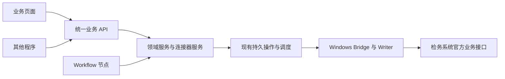

# 工作流简化与检务接口化方案

日期：2026-09-14；更新：2026-09-17。状态：第一批简化、P3 再生纤首批及电镜/纸纤维共享服务、原生节点和部分迁移已实现，P3/P4/P5 路线不变。交付范围和验证见[第一批实施记录](./simplification-batch-1.md)、[P3 首批验收](./p3-regenerated-fiber-acceptance.md)、[P3 第二批接口说明](./p3-domain-services-acceptance.md)和[原生领域节点验收](./p3-native-domain-acceptance.md)。再生纤查询/读取、电镜与纸纤维查询、显微工作簿生成可直接通过 API 调用，完整迁移候选仍为 **6/9**；通用检务写入/更正 API 仍属 P4。

方案核查基线：`feature/execution-system`，HEAD `3b5bf1b`，包含当时工作区中尚未提交的 P2 接替改动。以下现状分析记录方案提出时的依据；已实施项以实施记录为准。核查覆盖工作流定义、人工任务、发布管理、外部操作、Windows Bridge/Writer、配置和相关设计文档，没有访问生产数据库、执行检务写入或测量现场耗时。

## 1. 本次调整的前提与结论

采用用户明确的业务前提：**检务系统中的写入可以修改、纠正，不应被统一当作不可逆操作。自动化必须比人工录入省时，额外流程不能抵消自动化收益。**

建议把产品主路径改为：**识别任务和资料 → 一次补齐必要信息并提交 → 自动完成 → 可以直接更正结果**。接口调用方资料完整时直接提交，业务人员只在需要判断或补充资料时介入。

P2 接替、P3 领域拆分、P4 Connector 化、P5 设计器与旧实现退场的顺序和目标不变。简化是这些阶段的共同交付要求；不另建一套工作流引擎或审批平台。

三件事分别处理：

- **业务上能更正**：作为正常产品能力设计；提供修改、替换附件等入口。
- **程序如何完成更正**：当前适配器主要暴露新增、上传、复核、登记、校对，尚无统一记录更正接口。需要把旧系统既有修改能力接入，并按记录类型明确更新方式。
- **某次请求结果暂时未知**：由系统先读取实际状态，再完成、续办或重试；不再默认要求管理员填写整份对账证据。

这里需要保留的是“不要写错记录、不要重复新增、出错能定位和修正”，不需要保留所有历史确认步骤。

## 2. 当前到底哪些地方繁琐

### 2.1 已有的自动化应继续复用

| 当前事实 | 对简化方案的影响 |
| --- | --- |
| `EXECUTION_EXTERNAL_AUTO_APPROVE_ENABLED` 默认 `True`；部署能力可用时，Worker 预检后自动批准交付 | 不把“取消逐次外部批准”误列为从零开发。需核对部署是否使用此配置，本轮未核查生产设置 |
| 自动批准的 `approval_expires_at=None` | 旧手册的批准倒计时描述不适用于这条默认自动路径 |
| 文件选择已支持按配置自动提交唯一候选；多份项目的登记检查通常自动继续 | 推广已有能力，避免再做同样的自动选择功能 |
| 纸类没有判定要求且没有样品识别待选时，判定节点自动完成；报告图片无冲突时自动放置 | 图上有 `human` 节点，不代表每次运行都会要求人点击 |
| 外部操作已有幂等键、持久队列、执行尝试、回执、写入前失败重领 | 通用接口复用现有执行基础，避免第二套队列和重试逻辑 |

对应代码：[默认配置](/Users/lishuyang/PycharmProjects/textile-device-monitor/textile-device-monitor/backend/app/config.py:145)、[自动交付](/Users/lishuyang/PycharmProjects/textile-device-monitor/textile-device-monitor/backend/app/execution/engine.py:4092)、[自动批准有效期](/Users/lishuyang/PycharmProjects/textile-device-monitor/textile-device-monitor/backend/app/execution/external_operations.py:5340)、[唯一候选自动处理](/Users/lishuyang/PycharmProjects/textile-device-monitor/textile-device-monitor/backend/app/execution/engine.py:1433)、[登记与判定自动处理](/Users/lishuyang/PycharmProjects/textile-device-monitor/textile-device-monitor/backend/app/execution/engine.py:1664)。

### 2.2 2026-09-14 梳理的简化空间（实施前基线）

| 位置 | 当前行为及影响 | 建议 |
| --- | --- | --- |
| 日常入口 | 目录、运行准备、工作区、人工任务之间切换；启动页要求确认后创建运行 | 将查号、推荐资料、必要字段和提交放在同一业务页；单独准备页保留为高级入口 |
| 电镜打印 | `print-confirm` 位于原始记录生成与上传之间；即使不打印也要选择跳过 | 打印成为结果页动作或提交时的选项；不阻塞登记链。已有旧 Run 保持原行为 |
| 电镜信息录入 | 选图和登记信息分开收集，之后还有已有登记判断 | 尽量合为一次编辑：图片、项目、样品识别、结果、必要判定、现有记录处置 |
| 纸纤维 | 上传、复核之后才收集部分判定与登记信息 | 尽量在提交前补齐必要信息；减少写到一半又等待人的情况 |
| 已有登记 | 单份项目已有记录时，只有“直接新增/取消”，没有“修改这条” | 显示现有记录，支持“修改选中记录/明确新增另一份”；不按“已有数量”猜用户意图 |
| 登记前刷新 | Worker 强制请求一次任务快照，再每 2 秒等待；默认最长 60 秒；Writer 执行时又查询当前状态 | 浏览时缓存，提交时由连接器确认与本次操作相关的最新事实；结果未知时自动等候并继续，避免要求重跑整个流程 |
| 源文件 | 准备、自动批准、Bridge 领取会进入来源复核；根数法路径重新复制、哈希和读取 Excel | 对同一份内容生成一次稳定制品和解析结果；后续用内容身份复用，传输接收端验证实际字节 |
| Bridge 等待 | 默认空闲轮询 15 秒；Python 完成一项即退出，打包的守护脚本固定等 5 秒重启 | 优先减少空闲等待与任务间空档；不要把每个任务的执行时间简单说成固定增加 15 秒 |
| 执行容量 | 当前 `BRIDGE_GLOBAL_WRITE_CAPACITY=1` | 先去掉空等；再根据实测隔离不同样品/项目/账号的独立工作，同一目标继续串行 |
| 阶段回报 | 多个 Writer 阶段逐次向后端同步报告 | 必要的写入边界和完成结果持久化；纯进度日志可以合并回报，不必每条都是阻塞网络往返 |
| 写后异常 | 越过写入边界后失败直接进入 `reconciliation_required`，页面引导管理员手填证据 | 增加自动读取、比较与恢复，无法判明时才展示差异和处理选项 |
| 工作簿发布 | 原生发布实现要求匹配的人工批准回执 | 日常确定性生成文件使用显式自动发布策略；不能给旧契约伪造一张“人工批准”回执 |
| Release 管理 | 内容预检、导入、绑定、发布预检、发布、接替分步操作 | 对已知环境自动完成准备，集中展示问题，提供一次明确的发布/接替操作 |

这是从代码识别的操作成本和性能候选，尚不能据此认定各项在生产中占用多少秒，也不能承诺去掉某个检查就能提速多少。

证据：[业务流程定义](/Users/lishuyang/PycharmProjects/textile-device-monitor/textile-device-monitor/backend/app/execution/catalog.py:608)、[打印节点](/Users/lishuyang/PycharmProjects/textile-device-monitor/textile-device-monitor/backend/app/execution/catalog.py:1047)、[登记前强制刷新](/Users/lishuyang/PycharmProjects/textile-device-monitor/textile-device-monitor/backend/app/execution/engine.py:1567)、[源文件复核](/Users/lishuyang/PycharmProjects/textile-device-monitor/textile-device-monitor/backend/app/execution/external_operations.py:3180)、[Bridge 空闲轮询](/Users/lishuyang/PycharmProjects/textile-device-monitor/textile-device-monitor/tools/legacy_fibrecheck_bridge/bridge.py:1843)、[任务间等待](/Users/lishuyang/PycharmProjects/textile-device-monitor/textile-device-monitor/packaging/windows-bridge/runtime/ops/Invoke-WriteBridge.ps1:130)、[写后失败处理](/Users/lishuyang/PycharmProjects/textile-device-monitor/textile-device-monitor/backend/app/execution/external_operations.py:7353)、[发布回执要求](/Users/lishuyang/PycharmProjects/textile-device-monitor/textile-device-monitor/backend/app/execution/v2/native_handlers.py:550)。

## 3. 检查如何做减法

检查按目的和数据变化时机分配责任，不以“越多层越好”为目标。优先复用结果、减少 I/O 和等待，而不是简单删除条件判断。

| 类别 | 日常处理方式 | 仍然需要人处理的情况 |
| --- | --- | --- |
| 样品、项目和记录身份 | 自动精确定位，提交前显示目标摘要 | 多个确实可能的项目/记录、无法推断本次要修改哪条 |
| 必填字段、字段类型、业务约束 | 表单即时校验，服务端统一校验；直接标出缺失字段 | 主观判定、缺少标准值、需要人工选图等 |
| 资料选择 | 唯一且符合规则的候选自动使用，允许改选 | 多候选、质量判断、图片数量/内容需由人决定 |
| 来源与模板完整性 | 来源固定为本次提交的内容；解析按内容摘要与规则版本缓存 | 用户主动换资料、资料不完整或内容已改变影响结果 |
| 远端当前状态 | Writer 在实际执行点读取目标、版本及必要关联 | 他人已修改同一记录、目标已不可用，展示具体变化 |
| 写后结果 | 自动读取关键字段、附件及必要报告投影，形成结果回执 | 自动纠正后仍不一致，或实际状态无法辨认 |
| 人工批准 | 普通可更正写入直接执行；一次提交表达本次操作意图 | 确有业务要求的人工复核、真实冲突；不因 `external_write` 标签自动增加确认 |
| 发布、依赖和环境 | 管理阶段检查，复用与版本绑定的结果；运行时检查必要的有效性 | 依赖缺失、绑定失效、来源版本实质变化 |

前端的输入提示和服务端的最终校验可以并存；昂贵的全文件重读、反复查远端和重复表单应合并。只看相同路径、长度和修改时间，不能代替一次已经建立的真实内容身份。

校验结果可以复用的条件应明确，例如“同一制品摘要、解析器/规则/模板版本未变”。远端记录会被人工修改，不能用很久以前的成功回执证明它现在仍然正确；更正和恢复前应读取当前记录。

保留现有账号与执行权限，不另加默认双人审批、重复输入完整编号或额外安全确认步骤。检务系统的“校对/复核”是实际业务动作，可以由接口自动完成；它与本系统再次要求用户批准是不同的事情。通用登记现有“只保存、不校对”的行为仍应保持。

## 4. 推荐的接口与服务结构



核心是**页面、外部调用方和工作流使用同一份业务能力**。工作流只负责组合，不要求调用方先导入一个流程、创建 Run、寻找节点，再分别预检和批准。

### 4.1 接口按业务能力表达

以下是待实现的接口草案，采用现有 `/api/execution` 权限边界；名称可在 P4 冻结时统一。

| 接口 | 职责 |
| --- | --- |
| `POST /api/execution/connector-queries` | 指定连接器与已注册 `query_ref`，查询任务、已有记录、可用模板等 |
| `POST /api/execution/connector-operations` | 指定已注册 `operation_ref` 和类型化业务输入，一次提交新增、更新、复核等操作 |
| `GET /api/execution/connector-operations/{id}` | 返回状态、结果、业务回执、可执行的后续动作 |
| `GET /api/execution/connectors/{id}/capabilities` | 供客户端获取支持的查询、操作、输入结构和更正能力；不是让使用者手动配置一堆策略 |

更正、撤销和补做也是同一操作接口的命令，不再各建一条特殊工作流。查询若需要等待 Windows，只返回查询任务引用供自动续取；工作流中的 `connector.query` 仍遵循原 P4 的同步/缓存读取范围，不顺带扩大内核的异步查询语义。

例如更新一条已知记录，业务客户端提交：

```http
POST /api/execution/connector-operations
Idempotency-Key: <本次编辑提交的唯一标识，网络重试时不变>
Content-Type: application/json

{
  "connector_ref": "legacy_fibrecheck",
  "operation_ref": "check_record.generic.update@1",
  "target": {
    "project_ref": "<项目引用>",
    "record_ref": "<已有记录引用>",
    "expected_revision": "<读取该记录时的版本标识>"
  },
  "input": {
    "details": [
      {"real_location": "木浆", "real_value": "60-80"}
    ]
  }
}
```

该操作名、更新字段和版本标识目前均为设计项，不能拿示例调用现有 API。`input` 必须按 `operation_ref` 对应的独立契约校验，不是允许传任意 SQL、旧 DLL 方法或随意结构的请求。

`record_ref` 对应一条精确的远端记录，不用样品号或登记数量替代；若旧系统没有可用的版本字段，连接器可对相关业务字段生成版本指纹，实际更新时重新比较。同一个提交标识只对应同一份输入；内容改变应作为新的修改提交，不能沿用旧键假装网络重试。

客户端提交业务引用与数据。来源摘要、租约、执行阶段、回执校验和内部依赖由服务端处理。无需额外调用 prepare/approve；可选预览服务于“用户想先看差异”，不作为每次操作的前置步骤。

接受请求后快速返回 `202 + operation_id`，后台执行；排队不伪装成完成。业务页显示“处理中、需要补充/处理、已完成、未完成”，详细阶段放入可展开的执行记录。网络重发相同幂等键返回原操作，不重复新增；真正更正使用新的提交标识，并关联原记录/原操作。

### 4.2 从现有实现渐进抽取

当前 `ExecutionExternalOperation.run_id/node_run_id` 均非空，事件、取消、失败和完成也依赖 Run。**当前已有 HTTP 端点并不等于已经具备独立通用服务；只包装一个 URL 或把外键改可空都不够。**

1. 先抽出可复用的查询、输入准备、结果读取与写入服务入口，旧节点调用它们。
2. 初版独立 API 可由服务端创建专用内部执行记录承载现有 Run/NodeRun 依赖，调用方不接触流程管理。内部任务从普通业务目录/历史入口区分展示，但其权限、归属、审计和运行记录仍可查询。
3. P4 把操作的所有者、来源、幂等和生命周期从具体节点中抽出；Workflow 只订阅同一操作结果。是否去掉内部 Run，作为这一抽取的实现决定，不要求先重写所有存储才能提供接口。
4. 不增加第二套队列或另一个微服务。第一版继续使用现有 PostgreSQL、Worker 和 Windows Bridge；页面不直接调用 Windows Writer。
5. 七种写入复用一个执行外壳，保留各自输入、结果和业务语义。面积法/根数法、图片与纸类差异进入领域契约，不能用一个无约束大字典替代。

同一业务提交含上传、复核、登记等多个步骤时，页面可以显示一个提交任务，内部仍保留可单独恢复的执行结果；不承诺跨 Oracle、文件目录的全局事务。可在实测后减少重复启动/登录，但暂不以跨账号共享旧客户端静态登录态作为提速方法。

## 5. 把更正和自动恢复纳入正常使用

### 5.1 更正能力

| 用户意图 | 推荐语义 |
| --- | --- |
| 修改实测值、备注、样品识别等 | 选择目标 `record_ref`，显示差异，更新该记录及相关报告投影 |
| 替换原始记录附件 | 针对已有登记更新附件与相应采集结果；处理相关校对状态，不另造一条重复登记 |
| 撤销错误新增 | 使用该类型的删除、作废或补偿操作；实际方式由已接入的旧业务接口决定 |
| 保存成功、复核失败 | 从已有记录继续复核，不重新上传和新增 |
| 只有后续文件放置失败 | 补做文件放置，保留已经完成的检务录入 |
| 他人已经修改该记录 | 自动刷新当前值并展示差异；让用户决定保留现状还是提交新的修改 |

首批交付先把通用登记/首个实际业务场景的读取与修改打通，再逐类加入附件更换、撤销和校对状态处理。旧系统业务上可纠正不代表本适配器已经实现每一种自动撤销；已能修改的操作直接提供，未接入的动作显示准确的现有记录与旧系统处理信息，不把整个提交能力封锁到全部撤销接口完成之后。

每个更正操作记录目标、修改前后值、发起人、原操作引用和结果。旧 Run、旧回执继续保留；回执表达“当时做了什么”，当前记录页表达“现在是什么”。无需让用户填写技术摘要或再审批一次更正。

`replacement/revert` 只切换以后使用哪个工作流版本，不能撤销已写入的检务数据。检务更正和流程回切使用各自的操作，不混为一种回滚。

### 5.2 异常先交给系统恢复

| 自动读取到的状态 | 系统行为 |
| --- | --- |
| 已写入且与本次目标完全一致 | 补记完成结果，流程继续 |
| 可以确认尚未写入 | 自动有限重试同一操作 |
| 只完成了一部分，能够精确定位记录且有对应续办方法 | 从缺失步骤继续，例如仅补复核；保留已完成部分 |
| 存在可更正的差异，且更正范围属于本次提交意图 | 使用该类型的恢复/更正动作并再次读回 |
| 记录有新的人工修改、多个可能目标，或远端仍无法访问 | 暂停该操作，展示已采集的事实及明确选项；不要求手填哈希和计数 |

自动恢复应记录次数与耗时，达到操作自己的重试预算后再请求处理。同一目标在结果尚未确定时暂缓相互冲突的写入，其他独立任务继续处理。

新增记录的恢复需要保存足够的远端定位信息，例如可预分配的记录标识、实际返回的记录引用和附件身份；若旧接口不能预分配，就在取得记录标识后尽早持久化。缺少这些信息时不能仅凭“记录数多了一条”自动认定是本次成功。

“可修改”不能把超时当成“未保存”然后盲目新增；这样只会制造更多人工清理。自动查实、补做、更正比一概中止或一概重跑都更省时。当前 Writer 的恢复尚不支持上述完整路径，需要新增读取入口、稳定记录关联以及操作专用恢复方法。

## 6. 日常工作流与设计器怎样变简单

### 6.1 业务页面

- **再生纤面积法/根数法**：输入编号后自动查找并读取，唯一候选直接使用；多候选在同页选择，结果就地展示。保留两种方法的字段、图片和失败行为差异。
- **电镜**：编号、图片选择和必要登记信息集中编辑，一次“提交录入”；随后自动生成文件、上传、复核、登记和放置图片。打印在结果页按需执行；同名不同内容的文件只在确有冲突时询问。
- **纸纤维**：自动提取结果；样品识别、判定依据和标准值只在无法自动确定时补充。提交前尽量完成这次必要编辑，后续自动上传、复核及通用登记。
- **历史与更正**：结果页直接显示当前记录、附件和“修改/补做”等适用动作，不要求复制一条新流程从头运行。

正常输入完整的 API 请求为一次提交；需要人工选图/录入的业务目标为一次集中编辑、一次提交。不能为减少点击而默认选择有歧义的项目，也不能把真正需要人的业务判断伪装成自动确定。

### 6.2 流程作者

P3/P5 继续拆分底层可复用能力，同时让设计器提供少量常用业务组合，例如“发现并选择资料”“生成原始记录”“提交检务”。组合在高级视图中展开为已有基础节点和连接器操作；不用让作者每次手工连接十几个技术节点。

输入端口和领域服务传递结构化结果，逐步消除 `selection_node_id`、`generation_node_id`、`review_node_id` 及隐藏业务 flag。表单和选择 UI 由已定义的业务字段及 NodeSpec 提供；不再为每个项目重新写一套前端分支。

简单查询或单次保存通过接口直接调用，只有存在多步骤依赖、需要人工等待、分支或组合复用时才需要工作流。

### 6.3 发布管理

将操作体验收敛为“选择文件/候选 → 自动检查并填入已有环境绑定 → 查看问题与变更摘要 → 发布/接替”。已有绑定按环境复用，仅缺失或冲突的项需要编辑；预检令牌由界面和服务端管理。

首次接替仍使用新 Workflow ID/slug，归档旧入口，历史继续可查。界面可提供一次明确的“发布并接替”，服务端编排现有发布与激活操作：若发布成功而接替失败，新流程保持停用、旧流程仍服务，后续从未完成步骤继续。不得把二者说成天然的单事务，也不得因自动重新预检而静默接受已变化的来源流程。

普通后续发布维持当前启停状态。精确 Worker 匹配、不可变 Release/Run 和接替并发机制继续作为后台能力；不要求业务人员在每次运行时处理这些信息。

## 7. 实施顺序：不改变原路线

| 原阶段 | 增加的简化交付 | 完成依据 |
| --- | --- | --- |
| P2 收尾后的第一批小改动 | 修正过时文档；记录关键耗时；新候选中打印解耦、集中输入、复用已有自动完成；移除正常任务间固定空档；发布页面自动准备 | 能直接演示完整输入少打断、任务连续执行；不依赖完整 P4 才获得收益 |
| P3 首批：再生纤面积法/根数法（已实现） | `method=area\|count` 共享服务、直接查询/读取 API 和原生节点；请求内同一文件复用解析；唯一有效候选自动完成 | 完整候选已达 6/9；同批合成 `.xls/.xlsx` 新旧字段与图片摘要一致，API/Worker/前端及失败行为通过验证；现场语料待验收 |
| P3 后续：电镜与纸纤维（本地原生链已实现） | 共享 API、四个原生节点及本地步骤迁移已交付；图片和定性结果复用现有选择器，唯一候选自动完成；渲染只接收确认字段，不重复取任务单；后续集中必要业务输入 | API 下载无需 Run 或逐次批准；输出、图片、模板保持业务要求；完整业务迁移仍需 P4 外部链 |
| P4：Connector 化 | 统一查询/操作 API；共用执行服务；记录读取与首批更正；自动结果核对/续办；按实测消除重复 I/O、改善独立任务吞吐 | 页面和脚本调用同一能力；相同提交不重复新增；能更正结果；常见中断能自动恢复 |
| P5：设计器与旧实现退场 | 常用业务组合与高级展开；NodeSpec 驱动 UI；引用审计、业务回放和回切后逐项退役旧实现 | 新流程主要靠配置复用，旧运行和历史仍可访问 |

API 外观与服务入口可以在 P3 抽取时形成；完整通用 Connector、写入更正及自动恢复仍计入 P4，不把它们提前宣称为已完成。`.twr`、Release 内置 fixture 执行器、完整资源绑定界面继续单独登记。

建议先交付三个可独立演示的小批次，而不是等一次大重构：

1. **少点、少等**：输入整合、打印解耦、空闲/任务间等待优化、耗时记录。
2. **能力能复用**：按既定 P3 顺序抽取领域服务，页面和节点共同调用；形成统一接口的薄层。
3. **结果能改、失败能续**：在 P4 从一种记录类型开始完成读取、更正、自动恢复，再覆盖其余写入类型。

增加并发、复用旧客户端登录会话、批量执行不是第一批的前提。先用实测判断是否值得做，避免引入比省下的时间更多的复杂度。

## 8. 以效率为验收标准

### 8.1 先建立可比较的基线

选择同一批代表任务，比较人工旧客户端、当前自动化和简化后的实现。终点一致：需要的附件、登记、校对/复核和结果文件全部就绪；不能用“API 已接收”与“人工已录完”比较，也不能把人工少做了某个业务步骤的案例直接混在一起。

分别记录：人的实际操作时间、等待时间、端到端时间、主动确认次数、任务间页面切换、失败后恢复时间。系统拆出排队、查询、文件读取/哈希、Excel 处理、Windows 启动/登录、远端保存、读回、阶段回报耗时。优先复用现有事件时间戳，补充少量缺失指标即可。

覆盖唯一/多个候选、已有记录、需要判定、不需要判定、多人提交、保存后网络中断、人工更正过目标等典型情况。先收集约 20–30 个代表任务形成可用样本，再据差异补样，不为测量另建大型平台。

### 8.2 建议验收目标（目标值，非已有实测）

- 输入完整、无冲突：一次提交，零额外批准；API 返回的处理中状态清楚。
- 需要人工判断：集中一次编辑；只有后来出现的真实冲突再要求处理。
- 常规任务人的操作时间中位数至少比人工减少 50%；端到端耗时在同类任务上不慢于人工，重点检查高分位等待和异常恢复。
- 空闲时任务进入可执行队列到领取的目标为约 2 秒以内；有积压时单独统计排队，不把容量不足隐藏在平均值中。
- 同一请求重复提交不增加记录；更正更新明确目标，保留历史；部分成功可补做，不能只显示失败后让用户从头再来。
- 若某个场景仍比人工慢，定位到具体等待/校验/业务步骤后优化或提供直接接口入口，不能仅凭功能测试通过认定交付完成。

测试按变更范围集中执行：UI 简化验证实际交互；来源复用验证内容变化；更正验证当前记录与报告投影；状态机变化用 PostgreSQL 验证重复提交、续办与并发修改。一个批次完成后做相关全量回归，不要求用户每个日常提交都执行上线验收清单。

以上性能数值是现场验收目标。2026-09-17 已完成第一批本地回归和 Bridge 调度验证，详见实施记录；尚未测量真实检务系统的端到端耗时，不能据本地测试宣称已快于人工。

## 9. 设计文档需要同步的具体约定

实施时同步以下内容，避免代码已简化、文档仍要求重复检查：

1. [迁移矩阵原则](/Users/lishuyang/PycharmProjects/textile-device-monitor/textile-device-monitor/docs/execution-v2/current-node-migration-matrix.md:34)中的“批准、人工对账”改为明确的业务提交/可选人工处理与自动恢复职责；兼容契约继续冻结，新行为使用新版本。
2. [Workflow Release 发布约定](/Users/lishuyang/PycharmProjects/textile-device-monitor/textile-device-monitor/docs/execution-v2/workflow-release-v2.md:318)不再把所有外部写入默认扩展为双人批准；保留管理者一次发布/接替意图。
3. [NodeSpec 副作用约定](/Users/lishuyang/PycharmProjects/textile-device-monitor/textile-device-monitor/docs/execution-v2/node-spec-v2.md:479)区分“需要查清结果”与“必须人工对账”。新 OperationSpec 可声明自动查询与恢复方法；没有恢复方法的旧操作仍按旧契约运行。
4. 自动文件发布需要显式的新契约/策略及准确事件，不能静默修改 `artifact.publish@2` 的人工回执语义或冒充人工决策；内部 Excel 验收继续覆盖人工批准分支。
5. [旧 Bridge 手册](/Users/lishuyang/PycharmProjects/textile-device-monitor/textile-device-monitor/docs/legacy-fibrecheck-bridge-handoff.md:78)和 [FinalEntry 手册](/Users/lishuyang/PycharmProjects/textile-device-monitor/textile-device-monitor/docs/legacy-fibrecheck-final-entry.md:207)中逐次确认、倒计时、失败后只能人工对账等内容标明历史适用范围。实机语义继续以当前适配器和现场证据为准。
6. 后续“输出等价”验收比较业务结果与正确的失败/恢复行为；本方案实施时明确取消的确认步骤不再被当作必须复刻的体验。已有已发布契约、旧 Run 和回执不改写，新候选与 Pack 按真实语义变更升版。

2026-09-17 已按授权调整业务代码、Bridge 打包配置及相关文档。通用 Connector API、更正和自动结果核对仍按 P3/P4 分批交付；本轮没有部署或连接真实检务系统。
